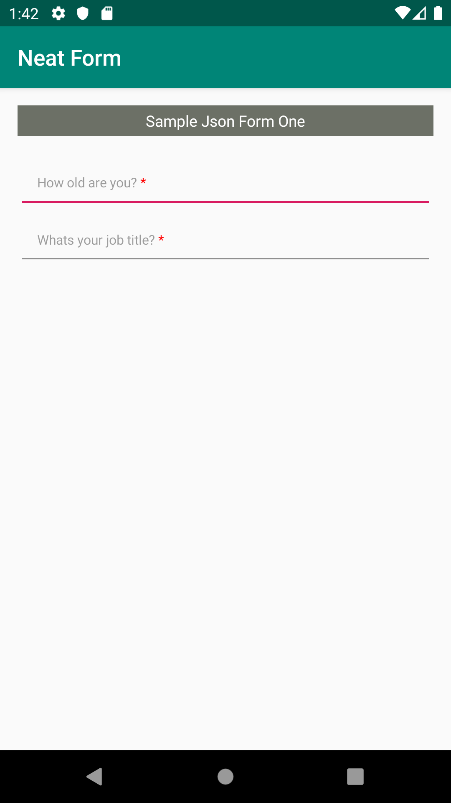

# Neat Form

NeatForm lets you create basic android views using JSON standard. This is especially useful when you are trying things out or when you need to update the UI without necessarily having to rebuild the app. NeatForm comes in handy when authoring forms with repetative UI designs but different configurations especially data collection forms. The idea behind this project was birthed out of frustration in working on such projects. The library will be shipped with common views used for data collection comprising of multiple question checkboxes, single question radio buttons, input text fields etc. In addition, ability to specify rules to handle skip logic and calculations on the form (All these done via JSON for the UI and JSON/YML for the Rules Engine as supported by [Easy Rules](https://github.com/j-easy/easy-rules)). NeatForm does not aim at replacing the spefied standard for creating views on Android that is using XML.  

[](https://www.codefactor.io/repository/github/ellykits/neatform) [](https://circleci.com/gh/ellykits/NeatForm/tree/master) [](https://codecov.io/gh/ellykits/NeatForm)

## Getting Started

These instructions will help you get started in setting up your forms and running the app. 
>Expect implementation of many views with the upcoming updates as work on this is still ongoing

### Authoring forms

Below is a sample json form that will be translated to the corresponding views.


| Form Attribute        | Usage                                                                             |
| ----------------------|:--------------------------------------------------------------------------------- |
| form                  |             Name of your form                                                     |
| is_multi_step         |   Indicates whether the form has multiple steps or not                            |  
| rules_file            | Specifies where to get the rules for handling skip logic and calculation          |
| count                 |               Number of steps in the form                                         |
| steps                 | The form steps with the desired fields                                            |
| metadata              | Information that you would also like to pass with the form when submitting data  
 |

```json
{
  "form": "Questionare",
  "is_multi_step": true,
  "rules_file": "rules/questionare1.yml",
  "meta_data": {
    "phone_number": "",
    "sim_serial": "",
    "author": ""
    },
  "count": 1,
  "steps": [
    {
      "title": "Demographics",
      "step_number": 1,
      "fields": [
       {
          "name": "age",
          "type": "edit_text",
          "properties": {
            "hint": "How old are you?",
            "type": "number",
            "text": "0",
            "text_size": "12",
            "padding": "4"
          },
          "required_status": "yes:Please add age"
        },
        {
          "name": "job_title",
          "type": "edit_text",
          "properties": {
            "hint": "Whats your job title?",
            "type": "name",
            "text_size": "12",
            "padding": "4"
          },
          "meta_data": {
            "openmrs_entity": "",
            "openmrs_entity_id": "",
            "openmrs_entity_parent": ""
          },
          "subjects": "age:number",
          "required_status": "true:please specify your job title"
        }
      ]
    }
  ]
}
```

You can also specify the rules in a YML file as required  by easy rule as shown below

```yaml
---
name: "job_title_visibility"
description: "Ask job title if age greater than 25"
priority: 1
condition: "age > 25"
actions:
  - "job_title_visibility = true"
```

## Examples

Here is a an example of ```EditText``` Generated from the above JSON.





## Built With

* [Easy Rules](https://github.com/j-easy/easy-rules) - Rules Engine library 
* [Mockk](https://mockk.io/) - Testing Framework Kotlin
* [GSON](https://github.com/google/gson) - Parsing JSON files

## RoadMap

* Completion of the remaining views - multichoice checkbox, spinner, buttons, radio buttons etc
* Data management - saving data from the input fields
* Multi language support
* Ability to obtain and render JSON form from server
* Rules Engine intergration - handle form skip logic and calculations

>NeatForm is currently in the infancy stage; a lot will change with addition of many cool features. Be sure to check in once in a while for updates.😄

## License

This project is licensed under the Apache 2.0 License - see the [LICENSE.md](LICENSE.md) file for details