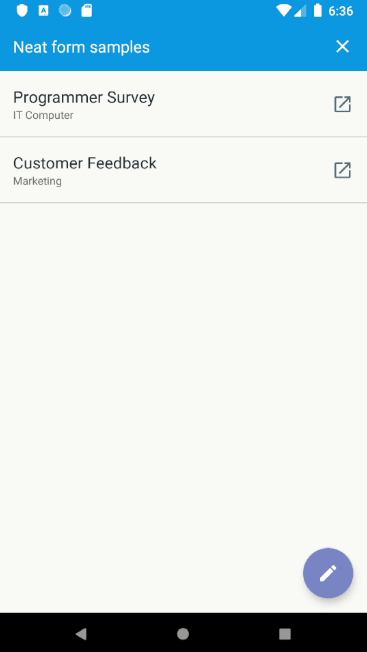
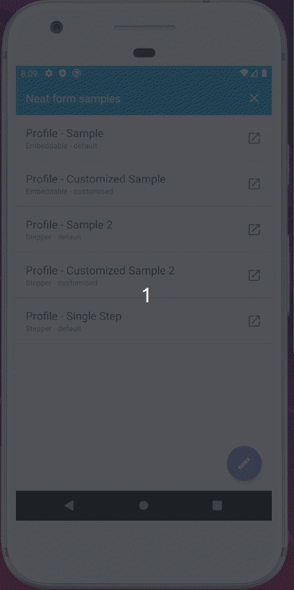

  
# Neat Form  
  
[](https://www.codefactor.io/repository/github/ellykits/neatform) [](https://circleci.com/gh/ellykits/neat-form/tree/master) [](https://codecov.io/gh/ellykits/neat-form)[  ](https://bintray.com/ellykits/nerdstone/neat-form-core/_latestVersion)  
  
NeatForm lets you generate android views using JSON schema. This is especially useful when you are trying things out or when you need to update the UI without necessarily having to rebuild the app. NeatForm comes in handy when authoring forms with repetative UI designs but different configurations especially data collection forms. The idea behind this project was birthed out of frustration in working on such projects. The library will be shipped with common views used for data collection comprising of multiple question checkboxes, single question radio buttons, input text fields etc. In addition, ability to specify rules to handle skip logic and calculations on the form (All these done via JSON for the UI and JSON/YML for the Rules Engine as supported by [Easy Rules](https://github.com/j-easy/easy-rules)). NeatForm does not aim at replacing Android view creation using XML.  
  
## Jump to section  

Read the full documentation on the [wiki](https://github.com/ellykits/neat-form/wiki)

* [Getting started](#getting-started)  
  * [Download package from GitHub](#download-from-github-packages)  
  * [Authoring form](#authoring-forms)  
  * [Adding form rules](#adding-form-rules)  
  * [Building the form](#building-the-form)  
  * [View validation](#view-validation)  
  * [Sample app demo](#app-demo)  
* [Built with](#built-with)  
* [Roadmap](#roadmap)  
* [Awesome Contributors](#awesome-contributors)  
* [License](#license)  
  
  
## Getting Started  
  
### Download (From JCenter)  
  
Add the library as a dependency to your app's `build.gradle` file  
```groovy  
dependencies {  
    //....  
    implementation "com.nerdstone:neat-form-core:1.1.4"  
   //....  
  
}  
```  
  
 ### Download (From GitHub Packages)  
  
This library is also available as a git package [Neat Form Packages](https://github.com/ellykits/neat-form/packages).  
  
At the moment GitHub requires you to be authenticated in order to download Android Libraries hosted in GitHub packages. To do so you will need your **personal access token** and your GitHub **userid/username**. Follow these steps to add the library as a dependency to your app.  
  
**Step 1** : Generate a Personal Access Token for GitHub [How to generate GitHub personal access token](https://help.github.com/en/github/authenticating-to-github/creating-a-personal-access-token-for-the-command-line)  
  
**Step 2** : Store your GitHub — Personal Access Token details  
Add these content to the **`local.properties`** file inside the root directory of your project.  
  
```  
gpr.usr=YOUR_GITHUB_USERID  
gpr.key=YOUR_PERSONAL_ACCESS_TOKEN  
```  
**Step 3** : Update `build.gradle` for the application module  
  
```groovy  
def githubProperties = new Properties()  
//Read the github properties content  
githubProperties.load(new FileInputStream(rootProject.file("local.properties")))  
  
android {  
     //...  
     // include inside the android closure  
    repositories {  
      maven {  
              name = "GitHubPackages"  
              /**  
             * Configure path of the package repository on Github using the GITHUB_USER_ID and * Git Repository */  
              url = uri("https://maven.pkg.github.com/ellykits/neat-form")  
              credentials {  
                  /** get credentials from local.properties in root project folder file with  
                 ** gpr.usr=GITHUB_USER_ID & gpr.key=PERSONAL_ACCESS_TOKEN otherwise ** Set env variable GPR_USER & GPR_API_KEY**/  
                  username = githubProperties['gpr.usr'] ?: System.getenv("GPR_USER")  
                  password = githubProperties['gpr.key'] ?: System.getenv("GPR_API_KEY")  
              }  
 } }    //...  
}  
  
```  
Add the library in the dependency section of your application's `build.gradle` file (obtain the latest version from [Neat Form Packages](https://github.com/ellykits/neat-form/packages))  
  
```groovy  
dependencies {  
   //consume library - use the latest version available on github packages  
   implementation "com.nerdstone:neat-form-core:1.1.4"  
   //....  
  
}  
```  
  
### Authoring forms  
  These instructions will help you get started in setting up your forms and running the app.  
>Expect implementation of many views with the upcoming updates as work on this is still ongoing  
  
First you will need to add the form file with its corresponding rules file to the assets directory of your application. Here are the supported attributes for the form.  
  
  
| Form Attribute        | Usage                                                                             |  
| ----------------------|:--------------------------------------------------------------------------------- |  
| form                  | Name of your form                                                                 |  
| rules_file            | File containing the rules for handling skip logic and calculation          |  
| steps                 | The form steps with the desired fields                                            |  
| metadata              | Additional information that you would also like to pass with the form when submitting data   |  
  
 *Sample form obtained from the sample app on this lib*  
  
```json  
{  
   "form":"Profile",  
   "rules_file":"rules/yml/sample_one_form_rules.yml",  
   "steps":[  
      {  
         "title":"Demographics",  
         "fields":[  
            {  
               "name":"adult",  
               "type":"text_input_edit_text",  
               "properties":{  
                  "hint":"Enter adult's phone number",  
                  "type":"name",  
                  "padding":"8"  
               },  
               "meta_data":{  
                  "openmrs_entity":"",  
                  "openmrs_entity_id":"",  
                  "openmrs_entity_parent":""  
               },  
               "validation":[  
                  {  
                     "condition":"value.length() <= 10",  
                     "message":"value should be less than or equal to ten digits"  
                  }  
               ],  
               "subjects":"age:number, child:text",  
               "required_status":"Yes:please add phone number"  
            },  
            {  
               "name":"age",  
               "type":"text_input_edit_text",  
               "properties":{  
                  "hint":"Enter your age",  
                  "type":"name",  
                  "padding":"8"  
               },  
               "meta_data":{  
                  "openmrs_entity":"",  
                  "openmrs_entity_id":"",  
                  "openmrs_entity_parent":""  
               },  
               "validation":[  
                  {  
                     "condition":"value.matches(\"^\\\\d{1,2}?$\")",  
                     "message":"Not a valid age"  
                  }  
               ],  
               "required_status":"yes:Please add age"  
            },  
            {  
               "name":"child",  
               "type":"text_input_edit_text",  
               "properties":{  
                  "hint":"I am a child",  
                  "type":"name",  
                  "padding":"8"  
               },  
               "meta_data":{  
                  "openmrs_entity":"",  
                  "openmrs_entity_id":"",  
                  "openmrs_entity_parent":""  
               },  
               "required_status":"yes:Please add age",  
               "subjects":"age:number"  
            },  
            {  
               "name":"email_subscription",  
               "type":"checkbox",  
               "properties":{  
                  "text":"Subscribe to email notifications"  
               },  
               "required_status":"yes:Please specify if you want subscription",  
               "subjects":"age:number"  
            },  
            {  
               "name":"gender",  
               "type":"spinner",  
               "properties":{  
                  "text":"Choose your gender"  
               },  
               "options":[  
                  {  
                     "name":"female",  
                     "text":"Female",  
                     "meta_data":{  
                        "openmrs_entity":"",  
                        "openmrs_entity_id":"A123390123123",  
                        "openmrs_entity_parent":""  
                     }  
                  },  
                  {  
                     "name":"male",  
                     "text":"Male",  
                     "meta_data":{  
                        "openmrs_entity":"",  
                        "openmrs_entity_id":"S8918313",  
                        "openmrs_entity_parent":""  
                     }  
                  }  
               ],  
               "subjects":"email_subscription:map",  
               "required_status":"yes:Please specify your gender"  
            },  
            {  
               "name":"country",  
               "type":"spinner",  
               "properties":{  
                  "text":"Choose your country of Origin",  
                  "searchable":"Search country"  
               },  
               "options":[  
                  {  
                     "name":"none",  
                     "text":"Select country"  
                  },  
                  {  
                     "name":"america",  
                     "text":"United States Of America",  
                     "meta_data":{  
                        "country_code":"+1"  
                     }  
                  },  
                  {  
                     "name":"canada",  
                     "text":"Canada",  
                     "meta_data":{  
                        "country_code":"+1"  
                     }  
                  },  
                  {  
                     "name":"uk",  
                     "text":"United Kingdom",  
                     "meta_data":{  
                        "country_code":"+44"  
                     }  
                  },  
                  {  
                     "name":"australia",  
                     "text":"Australia",  
                     "meta_data":{  
                        "country_code":"+61"  
                     }  
                  },  
                  {  
                     "name":"Kenya",  
                     "text":"Kenya",  
                     "meta_data":{  
                        "country_code":"+254"  
                     }  
                  },  
                  {  
                     "name":"tanzania",  
                     "text":"Tanzania",  
                     "meta_data":{  
                        "country_code":"+255"  
                     }  
                  },  
                  {  
                     "name":"china",  
                     "text":"China",  
                     "meta_data":{  
                        "country_code":"+86"  
                     }  
                  },  
                  {  
                     "name":"sweden",  
                     "text":"Sweden",  
                     "meta_data":{  
                        "country_code":"+1"  
                     }  
                  },  
                  {  
                     "name":"russia",  
                     "text":"Russia",  
                     "meta_data":{  
                        "country_code":"+7"  
                     }  
                  },  
                  {  
                     "name":"japan",  
                     "text":"Japan",  
                     "meta_data":{  
                        "country_code":"+81"  
                     }  
                  },  
                  {  
                     "name":"singapore",  
                     "text":"Singapore",  
                     "meta_data":{  
                        "country_code":"+65"  
                     }  
                  }  
               ],  
               "subjects":"email_subscription:map",  
               "required_status":"yes:Please specify your country"  
            },  
            {  
               "name":"choose_language",  
               "type":"multi_choice_checkbox",  
               "properties":{  
                  "text":"Pick the languages you are proficient in."  
               },  
               "options":[  
                  {  
                     "name":"eng",  
                     "text":"English",  
                     "meta_data":{  
                        "openmrs_entity":"",  
                        "openmrs_entity_id":"A123123123123",  
                        "openmrs_entity_parent":""  
                     }  
                  },  
                  {  
                     "name":"french",  
                     "text":"French",  
                     "meta_data":{  
                        "openmrs_entity":"",  
                        "openmrs_entity_id":"A123123123123",  
                        "openmrs_entity_parent":""  
                     }  
                  },  
                  {  
                     "name":"kisw",  
                     "text":"Kiswahili",  
                     "meta_data":{  
                        "openmrs_entity":"",  
                        "openmrs_entity_id":"A123123123123",  
                        "openmrs_entity_parent":""  
                     }  
                  },  
                  {  
                     "name":"need_help",  
                     "text":"Help me choose",  
                     "is_exclusive":true,  
                     "meta_data":{  
                        "openmrs_entity":"",  
                        "openmrs_entity_id":"A918928912",  
                        "openmrs_entity_parent":""  
                     }  
                  },  
                  {  
                     "name":"none",  
                     "text":"None of the above",  
                     "is_exclusive":true,  
                     "meta_data":{  
                        "openmrs_entity":"",  
                        "openmrs_entity_id":"A123123123123",  
                        "openmrs_entity_parent":""  
                     }  
                  }  
               ],  
               "validation":[  
                  {  
                     "condition":" value != null && value['need_help'] == null",  
                     "message":"You should be speaking at least one of the languages man!"  
                  }  
               ],  
               "required_status":"yes:Please specify your languages",  
               "subjects":"email_subscription:map, gender:text"  
            },  
            {  
               "name":"language_none",  
               "type":"edit_text",  
               "properties":{  
                  "hint":"Specify your language",  
                  "type":"name"  
               },  
               "meta_data":{  
                  "openmrs_entity":"",  
                  "openmrs_entity_id":"",  
                  "openmrs_entity_parent":""  
               },  
               "required_status":"true:Please specify language",  
               "subjects":"choose_language:map"  
            },  
            {  
               "name":"wiki_contribution",  
               "type":"radio_group",  
               "properties":{  
                  "text":"Have you ever contributed to or written a page in the Wiki?"  
               },  
               "options":[  
                  {  
                     "name":"yes",  
                     "text":"Yes"  
                  },  
                  {  
                     "name":"no",  
                     "text":"No"  
                  },  
                  {  
                     "name":"dont_know",  
                     "text":"Dont know"  
                  }  
               ],  
               "validation":[  
                  {  
                     "condition":"value != null && !value.containsKey('dont_know')",  
                     "message":"Don't know is not an option"  
                  }  
               ],  
               "required_status":"yes:Wiki contribution field is required.",  
               "subjects":"email_subscription:map"  
            },  
            {  
               "name":"wiki_contribution_yes",  
               "type":"edit_text",  
               "properties":{  
                  "hint":"What was your contribution?",  
                  "type":"name"  
               },  
               "validation":[  
                  {  
                     "condition":"value.startsWith('I')",  
                     "message":"Your statement must start with I"  
                  }  
               ],  
               "required_status":"true:Please specify your contributions",  
               "subjects":"wiki_contribution:map"  
            },  
            {  
               "name":"dob",  
               "type":"datetime_picker",  
               "properties":{  
                  "hint":"Enter birth date",  
                  "type":"date_picker",  
                  "display_format":"dd/MM/yyyy"  
               },  
               "required_status":"true:Please specify your dob"  
            },  
            {  
               "name":"time",  
               "type":"datetime_picker",  
               "properties":{  
                  "hint":"Enter time you clocked in",  
                  "type":"time_picker",  
                  "display_format":"hh:mm a"  
               },  
               "required_status":"true:Please specify the time you clocked in"  
            },  
            {  
               "name":"no_prev_pregnancies",  
               "type":"number_selector",  
               "properties":{  
                  "visible_numbers":"5",  
                  "max_value":"10",  
                  "first_number":"0",  
                  "text":"Number of previous pregnancies"  
               },  
               "validation":[  
                  {  
                     "condition":"value < 4",  
                     "message":"Advice woman to register for Family Planning"  
                  }  
               ],  
               "subjects":"email_subscription:map",  
               "required_status":"yes:Please number of previous pregnancy"  
            },  
            {  
               "name":"delivery_methods",  
               "type":"multi_choice_checkbox",  
               "properties":{  
                  "text":"Previous delivery methods."  
               },  
               "options":[  
                  {  
                     "name":"vaginal",  
                     "text":"Vaginal delivery",  
                     "meta_data":{  
                        "openmrs_entity":"",  
                        "openmrs_entity_id":"A12312332123123",  
                        "openmrs_entity_parent":""  
                     }  
                  },  
                  {  
                     "name":"c-section",  
                     "text":"C-Section",  
                     "meta_data":{  
                        "openmrs_entity":"",  
                        "openmrs_entity_id":"A12123123123123",  
                        "openmrs_entity_parent":""  
                     }  
                  }  
               ],  
               "subjects":"no_prev_pregnancies:number"  
            }  
         ]  
      }  
   ]  
}  
```  
### Adding Form Rules  

Neat form uses [Easy Rules](https://github.com/j-easy/easy-rules) - Rules Engine library  for handling form skip logic (logic for determining which widget should be shown/displayed on the form depending on the given condition). It is also used to perform form calculations.  
Easy Rules provides support for defining rules with [MVEL](https://www.github.com/mvel/mvel) . You can use either `JSON` or `YAML` specification. More about the expression language support [Easy Rules expression language support](https://github.com/j-easy/easy-rules/wiki/expression-language-support)  
  
*Sample Rules file defined using `YML` specification.*  
  
```yaml  
---  
name: "child_visibility"  
description: "children are not allowed to buy alcohol"  
priority: 1  
condition: "age <= 18"  
actions:  
 - "child_visibility = true"  
---  
name: "adult_calculation"  
description: "decade calculation"  
priority: 1  
condition: "true"  
actions:  
 - "import java.math.BigInteger;"  
 - "adult_calculation =  age * 10"  
---  
name: "adult_visibility"  
description: "adults can buy alcohol"  
priority: 1  
condition: "age > 18 || child == 'adult'"  
actions:  
 - "adult_visibility =  true"  
---  
name: "email_subscription_visibility"  
description: "Display email subscription checkbox"  
priority: 1  
condition: "age > 18"  
actions:  
 - "email_subscription_visibility =  true"  
---  
name: "language_none_visibility"  
description: "Specify language if none is chosen"  
priority: 1  
condition: "choose_language['none'] != null"  
actions:  
 - "language_none_visibility =  true"  
---  
name: "choose_language_visibility"  
description: "Ask the user the languages they are proficient in"  
priority: 1  
condition: "gender.value == 'Female'"  
actions:  
 - "choose_language_visibility =  true"  
---  
name: "gender_visibility"  
description: "Ask gender"  
priority: 1  
condition: "email_subscription != null"  
actions:  
 - "gender_visibility =  true"  
---  
name: "country_visibility"  
description: "Ask country"  
priority: 1  
condition: "email_subscription != null"  
actions:  
 - "country_visibility =  true"  
---  
name: "no_prev_pregnancies_visibility"  
description: "Ask last pregnancies"  
priority: 1  
condition: "email_subscription != null"  
actions:  
 - "no_prev_pregnancies_visibility =  true"  
---  
name: "wiki_contribution_yes_visibility"  
description: "Ask contribution"  
priority: 1  
condition: "wiki_contribution != null && wiki_contribution.containsKey('yes')"  
actions:  
 - "wiki_contribution_yes_visibility = true"  
---  
name: "wiki_contribution_visibility"  
description: "Wiki contribution"  
priority: 1  
condition: "email_subscription != null"  
actions:  
 - "wiki_contribution_visibility =  true"  
---  
name: "delivery_methods_visibility"  
description: "Delivery method"  
priority: 1  
condition: "no_prev_pregnancies > 0"  
actions:  
 - "delivery_methods_visibility =  true"  
```  
  >At the moment form `JSON` and rules are placed in **assets** directory. In future will provide a means of persisting the forms in a place where the can be easily updated.  
  
  
###  Building the Form
  
Neat Form parses the `JSON` form provided from the `Android Assets`  directory into a model that it uses to render the views. The supported views are registered first before the form is built. Once the views have been created as children to the the `RootView` they are then passed to the `FormBuilder`.  
You can override the supported views with your own implementation(s) if the features provided out of the box by neat form do not suffice. However one thing to note is that you can only extend the classes that implement `ViewBuilder` but not the `NFormView` classes.  
  
The views are rendered in 2 ways.  
  
1. Using the default vertical `LinearLayout` - Views are rendered as per the order they are defined on the `JSON` form on on top of the other. (Suitable for low resolution devices; phones)  
2. Using custom layout - Alternatively you may still want to control of the way the UI should appear across various devices for instances tablets, Neat Form gives you the flexibility of doing this by passing a list of the `xml` layout files to use when rendering the views.  
>NOTE: For multi-step forms, the form will be rendered to the custom layout sequentially i.e. step one form will be rendered on the layout at position 0 of the views list and so on.  
  
Code snippet from the sample app's ` com.nerdstone.neatform.form.FormActivity`  
  
 ```kotlin  
package com.nerdstone.neatform.form  
  
import android.os.Bundle  
import android.support.v7.app.AppCompatActivity  
import android.view.View  
import android.widget.ImageView  
import android.widget.LinearLayout  
import android.widget.TextView  
import com.nerdstone.neatform.R  
import com.nerdstone.neatformcore.domain.builders.FormBuilder  
import com.nerdstone.neatformcore.form.json.JsonFormBuilder
import com.nerdstone.neatformcore.form.json.JsonFormEmbedded
  
  
class FormActivity : AppCompatActivity() {  
    private lateinit var mainLayout: LinearLayout  
    private lateinit var pageTitleTextView: TextView  
    private lateinit var exitFormImageView: ImageView  
    private var formBuilder: FormBuilder? = null  
  
    override fun onCreate(savedInstanceState: Bundle?) {  
        super.onCreate(savedInstanceState)  
        setContentView(R.layout.form_activity)  
  
        mainLayout = findViewById(R.id.mainLayout)  
        pageTitleTextView = findViewById(R.id.pageTitleTextView)  
        exitFormImageView = findViewById(R.id.exitFormImageView)
  
        if (intent.extras != null) {  
            val path = intent?.extras?.getString("path") ?: ""  
            val pageTitle = intent?.extras?.getString("page")?.capitalizeWords()  
            pageTitleTextView.text = pageTitle  
            exitFormImageView.setOnClickListener {  
                if (it.id == R.id.exitFormImageView) {  
                    finish()  
                }  
            } 

          //Create an embbeded JSON Form within mainLayout
          formBuilder = JsonFormBuilder(this, formData.filePath)
          JsonFormEmbedded(formBuilder as JsonFormBuilder, mainLayout).buildForm()         
        }  
    }  
}  
 ```  
  
### View validation  
  
Neat form uses Rules Engine to perform validations. The validation functionalities are wrapped inside `NeatFormValidator`. Each widget has a property referred to as `formValidator` that accepts a singleton instance of the validator class. Every widget is tasked with validating their own data via the overridden `validateValue` method. The validator class provides common functionality for validating fields through `validateLabeledField` and `validateField` methods; with the former used to validate widgets with top labels like `MultiChoiceCheckbox` and `RadioGroupView`, the later is used to validate the rest of the fields.  
  
To validate a field add this to its JSON definition:  
  
```json  
"validation": [  
    {  
      "condition": "value < 4",  
      "message": "Advice woman to register for Family Planning"  
    }  
  ]  
```  
The *condition* is evaluated and validation result returns `true` when the field is valid, `false` otherwise. The *message* attribute  holds the error message displayed on the view when a field is invalid.  
  
>NOTE: value is a special kind of keyword in Neat form used to refer to the value of the current field. You can use the name of the field instead. With this approach you can potentially perform validation against other fields as well. Like in the case of password confirmation.  
  
### App demo  
Please check out the sample app for this demo.  
  
App rendered using the default RootView (`LinearLayout`) and custom layout respectively.  
 <p>  </p>  
  
Custom  `sample_one_form_custom_layout.xml` layout  used for rendering views  
  
```xml  
  
<?xml version="1.0" encoding="utf-8"?>  
<android.support.constraint.ConstraintLayout xmlns:android="http://schemas.android.com/apk/res/android"  
    xmlns:app="http://schemas.android.com/apk/res-auto"  
    android:layout_width="match_parent"  
    android:layout_height="match_parent">  
  
    <LinearLayout  
        android:id="@+id/layout_age"  
        android:layout_width="match_parent"  
        android:layout_height="match_parent"  
        android:orientation="horizontal"  
        app:layout_constraintEnd_toEndOf="parent"  
        app:layout_constraintStart_toStartOf="parent">  
  
        <com.nerdstone.neatformcore.views.widgets.TextInputEditTextNFormView  
            android:id="@+id/age"  
            android:layout_width="0dp"  
            android:layout_height="wrap_content"  
            android:layout_marginTop="16dp"  
            android:layout_weight="1">  
  
            <android.support.design.widget.TextInputEditText  
                android:layout_width="match_parent"  
                android:layout_height="wrap_content" />  
        </com.nerdstone.neatformcore.views.widgets.TextInputEditTextNFormView>  
  
        <com.nerdstone.neatformcore.views.widgets.TextInputEditTextNFormView  
            android:id="@+id/child"  
            android:layout_width="0dp"  
            android:layout_height="wrap_content"  
            android:layout_marginStart="16dp"  
            android:layout_marginTop="16dp"  
            android:layout_weight="1"  
            android:visibility="gone">  
  
            <android.support.design.widget.TextInputEditText  
                android:layout_width="match_parent"  
                android:layout_height="wrap_content" />  
        </com.nerdstone.neatformcore.views.widgets.TextInputEditTextNFormView>  
  
        <com.nerdstone.neatformcore.views.widgets.TextInputEditTextNFormView  
            android:id="@+id/adult"  
            android:layout_width="0dp"  
            android:layout_height="wrap_content"  
            android:layout_marginStart="16dp"  
            android:layout_marginTop="16dp"  
            android:layout_weight="1"  
            android:visibility="gone">  
  
            <android.support.design.widget.TextInputEditText  
                android:layout_width="match_parent"  
                android:layout_height="wrap_content" />  
        </com.nerdstone.neatformcore.views.widgets.TextInputEditTextNFormView>  
  
  
    </LinearLayout>  
  
    <com.nerdstone.neatformcore.views.widgets.CheckBoxNFormView  
        android:id="@+id/email_subscription"  
        android:layout_width="wrap_content"  
        android:layout_height="wrap_content"  
        app:layout_constraintStart_toStartOf="@+id/layout_age"  
        app:layout_constraintTop_toBottomOf="@+id/layout_age" />  
  
    <com.nerdstone.neatformcore.views.widgets.SpinnerNFormView  
        android:id="@+id/gender"  
        android:layout_width="wrap_content"  
        android:layout_height="wrap_content"  
        android:layout_marginTop="16dp"  
        app:layout_constraintStart_toStartOf="@+id/email_subscription"  
        app:layout_constraintTop_toBottomOf="@+id/email_subscription" />  
  
    <com.nerdstone.neatformcore.views.containers.MultiChoiceCheckBox  
        android:id="@+id/choose_language"  
        android:layout_width="wrap_content"  
        android:layout_height="wrap_content"  
        android:layout_marginTop="16dp"  
        app:layout_constraintStart_toStartOf="@+id/gender"  
        app:layout_constraintTop_toBottomOf="@+id/gender" />  
  
    <com.nerdstone.neatformcore.views.widgets.EditTextNFormView  
        android:id="@+id/language_none"  
        android:layout_width="wrap_content"  
        android:layout_height="wrap_content"  
        android:layout_marginTop="16dp"  
        app:layout_constraintStart_toStartOf="@+id/gender"  
        app:layout_constraintTop_toBottomOf="@+id/choose_language" />  
  
    <com.nerdstone.neatformcore.views.containers.RadioGroupView  
        android:id="@+id/wiki_contribution"  
        android:layout_width="wrap_content"  
        android:layout_height="wrap_content"  
        android:layout_marginTop="16dp"  
        app:layout_constraintStart_toStartOf="@+id/gender"  
        app:layout_constraintTop_toBottomOf="@+id/language_none" />  
  
  
    <com.nerdstone.neatformcore.views.widgets.EditTextNFormView  
        android:id="@+id/wiki_contribution_yes"  
        android:layout_width="wrap_content"  
        android:layout_height="wrap_content"  
        android:layout_marginTop="16dp"  
        app:layout_constraintStart_toStartOf="@+id/gender"  
        app:layout_constraintTop_toBottomOf="@+id/wiki_contribution" />  
  
    <LinearLayout  
        android:orientation="horizontal"  
        android:id="@+id/date_time_layout"  
        android:layout_width="match_parent"  
        android:layout_height="wrap_content"  
        app:layout_constraintStart_toStartOf="@+id/gender"  
        app:layout_constraintTop_toBottomOf="@+id/wiki_contribution_yes">  
        <com.nerdstone.neatformcore.views.widgets.DateTimePickerNFormView  
            android:id="@+id/dob"  
            android:layout_width="0dp"  
            android:layout_weight="1"  
            android:layout_height="wrap_content"  
            android:layout_marginTop="16dp" />  
  
        <com.nerdstone.neatformcore.views.widgets.DateTimePickerNFormView  
            android:id="@+id/time"  
            android:layout_width="0dp"  
            android:layout_weight="1"  
            android:layout_height="wrap_content"  
            android:layout_marginTop="16dp"  
            android:layout_marginLeft="16dp"/>  
    </LinearLayout>  
  
  
  
    <com.nerdstone.neatformcore.views.widgets.NumberSelectorNFormView  
        android:id="@+id/no_prev_pregnancies"  
        android:layout_width="wrap_content"  
        android:layout_height="wrap_content"  
        android:layout_marginTop="16dp"  
        app:layout_constraintStart_toStartOf="@+id/gender"  
        app:layout_constraintTop_toBottomOf="@+id/date_time_layout" />  
  
    <com.nerdstone.neatformcore.views.containers.MultiChoiceCheckBox  
        android:id="@+id/delivery_methods"  
        android:layout_width="wrap_content"  
        android:layout_height="wrap_content"  
        android:layout_marginTop="16dp"  
        app:layout_constraintStart_toStartOf="@+id/gender"  
        app:layout_constraintTop_toBottomOf="@+id/no_prev_pregnancies" />  
  
</android.support.constraint.ConstraintLayout>  
```  
  
>1. The **id** of the views MUST match the **name** attribute of the fields in the `JSON` for custom view rendering to work.  
>2. Another thing to note is the use of NeatForm Custom `Views` on the `XML` layout file.  
>3. Using custom layout give you the flexibility of styling and arranging your views the way you want them to be. Allowing the use of other view attributes not supported by the library.  
>4. `JSON` form attributes takes precedence over the `XML` attributes if same attributes are defined on the `JSON` form and on the `XML`  
  
  
## Built With  
  
* [Easy Rules](https://github.com/j-easy/easy-rules) - Rules Engine library  
* [Mockk](https://mockk.io/) - Testing Framework Kotlin  
* [GSON](https://github.com/google/gson) - Parsing JSON files  
* [Smart Material Spinner](https://github.com/Chivorns/SmartMaterialSpinner) - Powerful android spinner library
  
## RoadMap  
  
| Status        | Action                                                                             |  
| ----------------------|:--------------------------------------------------------------------------------- |  
| ✔️ |️ Implementation of the common views - *multichoice checkbox, spinner, buttons, radio buttons number selector*|  
| ✔️ |️ Data management - saving data from the input fields |  
| ✔️ |️ Form Fields Validation |  
| ✔️ |️ Support Multi-Step Forms |  
| ✔️ |️ Rules Engine integration - handle form skip logic and calculations |  
| ❌ |️ Support image and location picker and barcode reader |  
| ❌ |️ Multi language support |  
| ❌ |️ Ability to obtain and render `JSON`form from server |  
  
>If you need addition of more attributes on the current widgets or new widget implementations, create an issue. Contributions are also welcome.  
  
## Awesome Contributors  

* [cozej4](https://github.com/cozej4)

## License  
  
This project is licensed under the Apache 2.0 License - see the [LICENSE](./LICENSE) file for details